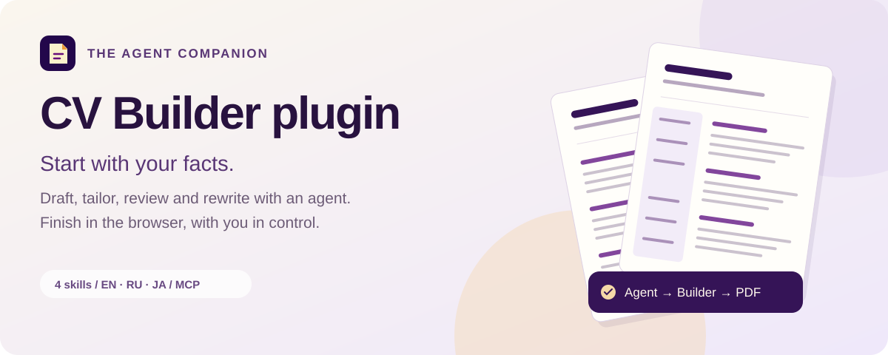

<p align="center">
  
</p>

<h1 align="center">CV Builder plugin</h1>

<p align="center">Write your resume with an agent. Edit and export it in your browser.</p>

<p align="center">
  <a href="https://flodirka.github.io/cv-builder-web/"></a>
  <a href="#install"></a>
  <a href="#support-the-project"></a>
</p>

<p align="center"><a href="#skills">Skills</a> · <a href="#install">Installation</a> · <a href="#writing-quality">Writing quality</a> · <a href="#privacy">Privacy</a></p>

CV Builder combines four resume-writing skills with a public MCP server in one account-free
plugin. It uses the Claude Code plugin format and can be installed from this repository. The
same skills and MCP server are prepared for the Claude and ChatGPT/Codex plugin directories.

The plugin helps agents draft, tailor, review, and rewrite resume content as canonical
`cv-builder/v1` Markdown. Its public `open_builder` MCP tool hands the result to the
browser-based CV Builder. Editing, ATS preflight, and PDF export happen in the user's browser.
The plugin never renders, stores, or transmits a PDF and introduces no accounts, OAuth, or
persistent server-side storage.

## From facts to a finished resume

1. Give the agent your experience, skills and the task: draft, tailor, review or rewrite.
2. Review the proposed wording, confirm missing facts, and open the document in CV Builder.
3. Make your final edits and download the PDF from the browser.


_The published editor with a fictional sample resume. Editing and PDF export run in your browser._

## Skills

| Skill                  | What it does                                                                 |
| ---------------------- | ---------------------------------------------------------------------------- |
| `create-resume`        | Draft a new resume from your facts in a shipped skeleton (EN/RU/JA).         |
| `tailor-resume`        | Adapt an existing resume to a job posting without inventing facts.           |
| `review-resume`        | Critique content, structure, and ATS safety with the Builder's own criteria. |
| `rewrite-achievements` | Rewrite bullets into action-result form with honest quantification.          |

## Writing quality

Every skill includes a required writing-quality reference based on Improve Writing, Edit Russian
text, Edit English text and Humanize content. It covers language correction, clear professional
wording, removal of mechanical phrasing, and a final comparison with the supplied facts.

Russian and English have separate language passes. The plugin preserves role ownership,
uncertainty, exact terminology and document structure. It never adds metrics, outcomes or fake
personal details to make a resume sound stronger or more human. These rules ship with the plugin;
no additional writing skills are required. Japanese documents retain their language and form.

## MCP server

`.mcp.json` binds the remote server `cv-builder` at
`https://cv-builder-relay.flodirka.workers.dev/mcp` (Streamable HTTP, anonymous, no
credentials). Its one tool, `open_builder`, accepts canonical Markdown and returns a link that
opens the document in the Builder and expires after five minutes. The server also exposes the Markdown grammar, a template index and fifteen editable examples matching the editor.
Each skill carries the relevant resource copies in its `references/`, regenerated from the
server source on every release.

The server instructions identify those resources and describe the editor and relay boundaries;
they do not direct model behavior. The grammar resource contains the format, validation, and
content-quality guidance, while each skill adds workflow-specific instructions. Tailoring is
optional, so an agent should ask for a job description only when the user requests tailoring
and the posting would change the content. Formatting always uses one canonical Markdown shape
with supported columns, tables, photos, heading icons and page breaks. Renderer settings are owned by the browser editor.

Version 0.2.0 adds country guidance and the Japanese rirekisho example alongside CV Builder Web 0.2.0 and MCP 1.1.0. All examples use fictional facts.

## Related projects

- [CV Builder Web](https://flodirka.github.io/cv-builder-web/) is the published local-first
  resume editor where editing, ATS preflight, and PDF export happen.
- [cv-builder-web](https://github.com/Flodirka/cv-builder-web) is the public source repository
  for the editor that receives documents from this plugin.

## Install

### Claude Code

```text
/plugin marketplace add Flodirka/cv-builder-plugin
/plugin install cv-builder@cv-builder
```

### ChatGPT and Codex

The OpenAI submission uses the production MCP endpoint and the same four skills through the
With MCP path.

### Any other MCP client

Add the remote server URL above directly. The skills are plain Markdown and can also be read
without installation.

## Privacy

The only data that leaves the chat is the Markdown document an agent passes to `open_builder`.
The relay holds it in an ephemeral session for at most five minutes, deletes it when the Builder
acknowledges the import, logs no content, and keeps no accounts. The Builder itself keeps the
resume in the browser only.

Read the complete [privacy policy](https://github.com/Flodirka/cv-builder-plugin/blob/main/PRIVACY.md) and [terms of use](TERMS.md).

## Versioning

Semver in `.claude-plugin/plugin.json`; Claude Code delivers updates only when `version`
changes, so every release bumps it.

## Support the project

CV Builder is free and account-free. If it is useful to you, you can support further
development:

<p align="center">
  <a href="https://boosty.to/gdview_gdbrain/donate"></a>
  <a href="https://www.patreon.com/15806620/join"></a>
  <a href="https://dalink.to/flodirka"></a>
</p>

See [SUPPORT.md](SUPPORT.md) for details. Support is voluntary and never affects the product:
no accounts, no perks, no feature gates.
